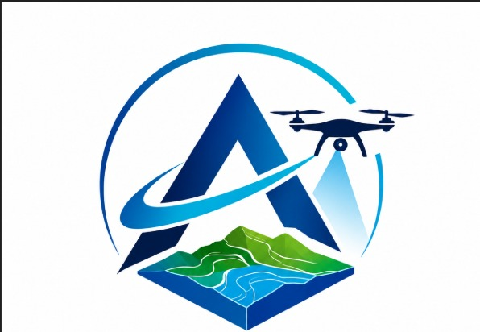

<div align="center">
  

  # AeroRecon ??
  
  **Fully Automated UAV 3D Reconstruction & Photogrammetry Pipeline**

  [](https://www.python.org/)
  [](https://fastapi.tiangolo.com/)
  [](https://reactjs.org/)
  [](https://threejs.org/)
  [](LICENSE)

  *Built for the Smart India Hackathon (SIH 26158)*
</div>

---

## ?? What AeroRecon Does

AeroRecon is a fully automated, end-to-end 3D reconstruction pipeline designed to process UAV (drone) video and GPS telemetry into highly accurate metric 3D models and orthomosaics. 

It implements robust **readiness validation**, **Structure-from-Motion (SfM)**, **dense Multi-View Stereo (MVS)**, **surface meshing**, **texturing**, and **scientific heatmap visualization** directly in the browser.

## ? Key Features

* **?? Automated Ingestion:** Extracts high-quality frames, validates GPS synchronization, and filters blurry inputs automatically.
* **?? Geospatial Alignment:** Recovers sparse geometry via COLMAP and aligns the trajectory to GPS tracks using robust Sim(3) transforms.
* **?? Dense Reconstruction:** Generates accurate depth maps and fuses them into dense point clouds (PatchMatchStereo).
* **?? Meshing & Texturing:** Reconstructs Poisson surfaces and applies ray-casting occlusion texturing for photorealistic models.
* **?? Browser-Based 3D Viewer:** Explore your missions with a 6-mode interactive 3D WebGL viewer (Textured, Mesh, Dense, Sparse, Semantic, Point Density heatmaps).
* **?? Measurement Tools:** Perform precise Distance, Area, and Slope measurements natively in the browser.
* **?? Standardized Exports:** Delivers automated output bundles containing `.PLY`, `.OBJ`, `.LAS`, `.GeoTIFF`, and `.GLB` artifacts.

## ?? Installation & Quick Start

### Prerequisites
* Windows 10/11 or Linux
* Python 3.10+
* Node.js v18+ (for frontend development)
* NVIDIA GPU (CUDA 11.8+) with at least 8 GB VRAM recommended
* Redis (for background task queuing)
* **COLMAP 4.1+** available in system PATH

### Setup

1. **Clone the repository:**
   ```bash
   git clone https://github.com/RohanChudasama19/Aakar-Sih-26158.git
   cd Aakar-Sih-26158
   ```

2. **Install Python dependencies:**
   ```bash
   python -m venv .venv
   source .venv/Scripts/activate  # (Windows)
   pip install -r requirements.txt
   ```

3. **Start the background worker:**
   ```bash
   python -m app.worker
   ```

4. **Start the web API & Frontend:**
   ```bash
   # Run the provided start script to launch everything automatically
   ./scripts/start-aerorecon.ps1
   ```

5. **Access the application:**
   Navigate to [http://localhost:8000](http://localhost:8000)

## ?? Repository Structure

```text
AeroRecon/
+-- app/                  # FastAPI Backend & Core Pipeline Engine
+-- frontend/             # React SPA Source Code
+-- web/                  # Compiled Production Frontend Build
+-- docs/                 # Audit Reports and Demonstrations
+-- scripts/              # CI/CD, Utility, and Archive Scripts
+-- tests/                # Automated Regression & Health Tests
+-- models/               # AI/ML ONNX & PyTorch Models
+-- demo/                 # Test Datasets and Offline Demo Assets
```

## ?? Contributors

This repository represents the collaborative effort of our 6-person team over a continuous 15-day sprint for SIH 26. 
Check out the full list of team members and their roles in the [CONTRIBUTORS.md](CONTRIBUTORS.md) file!

## ?? Demo Mode

To instantly test the pipeline without a drone:
1. In the Web UI Dashboard, click **"Use bundled sample files"**.
2. A synthetic 6-second flight will be staged.
3. Select the **'CPU'** engine profile and click Start for a rapid end-to-end smoke test!

---
<div align="center">
  <i>Developed by Team Aakar</i>
</div>

